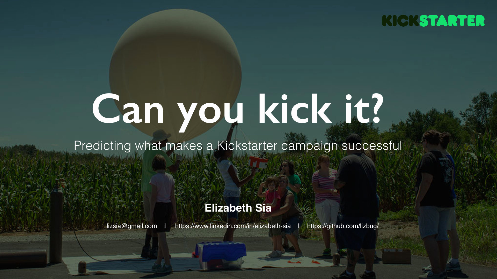
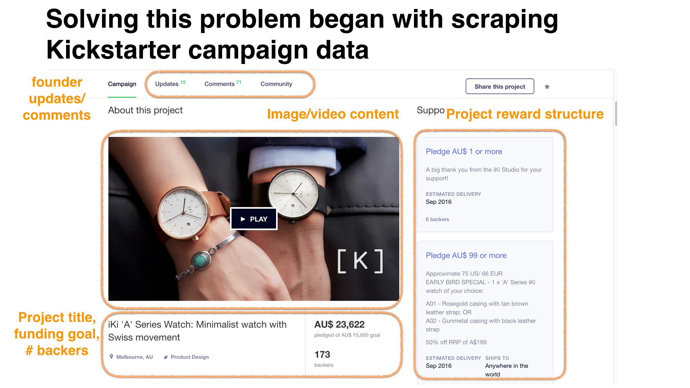
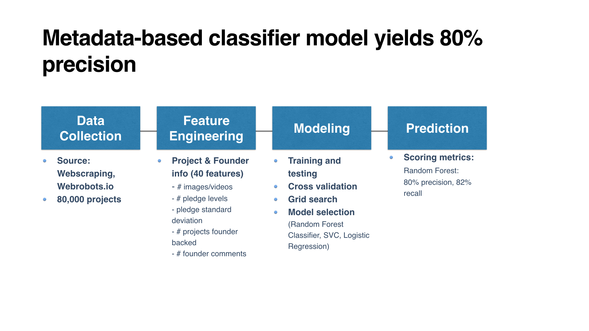
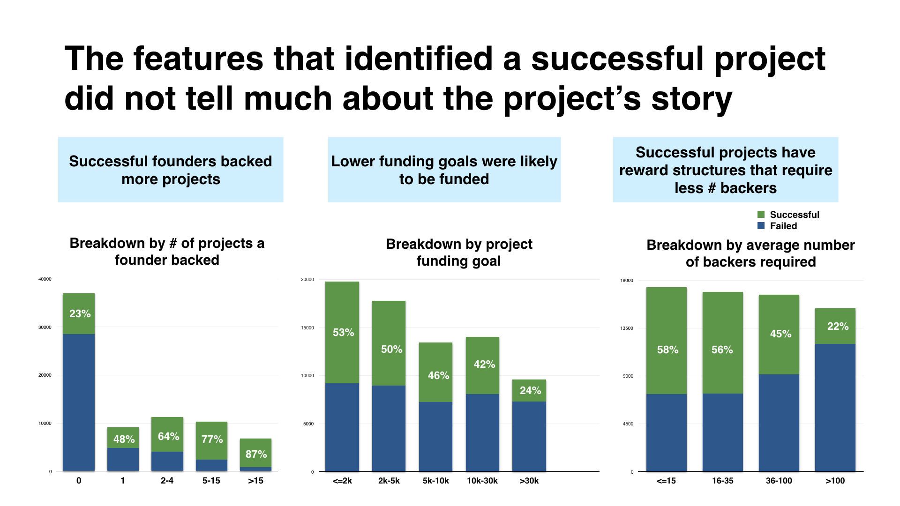
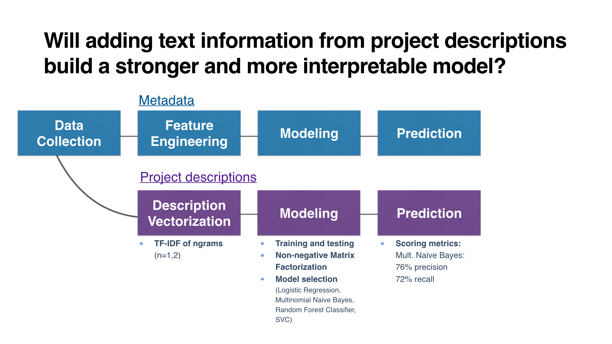
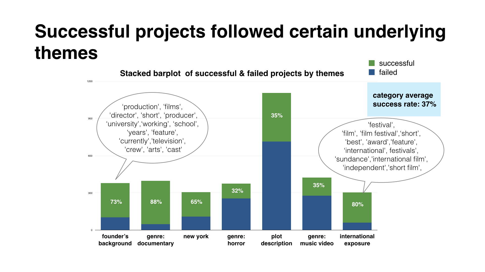
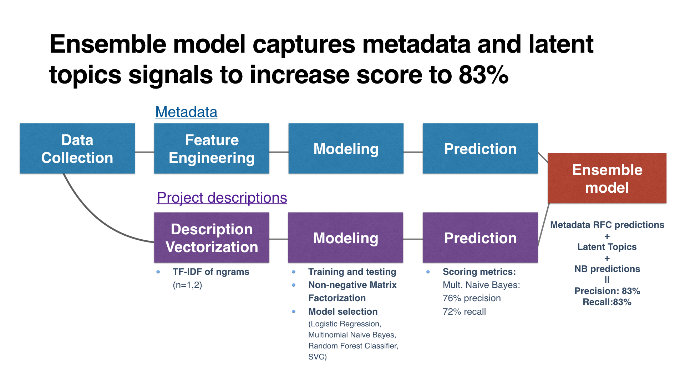

# Motivation
Kickstarter is a crowdfunding platform with the goal of bringing creative projects to life. The thing is, very few campaigns go on to be successfully funded. These successful campaigns can take many and sometimes unusual forms, e.g. [Potato Salad campaign](https://www.kickstarter.com/projects/zackdangerbrown/potato-salad). This project aims to understand what contributes to the success of a campaign. While there are many factors that contribute to the success of a campaign, this capstone project will focus on analyzing campaign content and structure.

# Data Collection
I leveraged the dataset from  https://webrobots.io/kickstarter-datasets/ and enhanced this by scraping more features from Kickstarter.com. Data was cleaned using Python's Pandas package and stored in MongoDB. This dataset contains 80,000 projects between 2013-2016. An example of some of the campaign features scraped is shown below.

# Modeling

## Metadata Modeling
I started with logistic model for interpretability, and went on to train multiple models. Random Forest Classifier performed the best due to its capability to handle multiple types of data and outliers.

The model confirm a few things we know to be true intuitively.

## Text Modeling
I performed TF-IDF "bag of words" analysis of the project descriptions. I found that successful projects tend to show more tech related words, inferring that certain types of tech projects were more likely to be successfully funded. As success factors might vary by category, TF-IDF was performed at the categorical level.

I then used Non-Negative Matrix Factorization to model latent topics in the project descriptions and looked at the top terms associated with each latent topic. Based on the top terms by topic, I found that these topics had very interpretable divisions in themes. This is illustrated below for projects in the Film category.

My final classification model is an ensemble model made up of:
  - Metadata Random Forest model
  - Text Multinomial Naive Bayes model
  - Latent topics NMF model

# Future Work

1. A portion of campaign descriptions were displayed in images and therefore not included in the TF-IDF analysis. Going forward I would use optical character recognition tools to detect text within the images.
2. Sentiment analysis of user comments
3. This would require more effort, but it would be interesting to see how successful campaigns fare post-funding. Is there more demand for the product or has Kickstarter fully reflected and exhausted the true demand for the product?