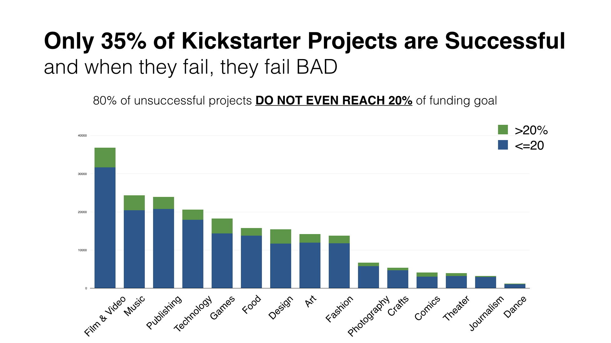

# Capstone_Project_CanYouKickIt

The aim of this project is to find out what features make a Kickstarter campaign successful. This Data Science capstone project was built in 2 weeks.

# Data Collection
I leveraged the dataset from  https://webrobots.io/kickstarter-datasets/ and enhanced this it by scraping more features from Kickstarter.com. I used Python's Pandas package for data cleaning and storage. This dataset contains 80,000 projects between 2013-2016.

# Modeling

## Metadata Modeling
I started with logistic model for interpretability, and went on to train multiple models. Random Forest Classifier performed the best due to its capability to handle multiple types of data and outliers.

## Text Modeling
I performed TF-IDF "bag of words" analysis of the project descriptions. I found that successful projects tend to show more tech related words, inferring that certain types of tech projects were more likely to be successfully funded. As success factors might vary by category, I performed TF-IDF at the category level.

I then used Non-Negative Matrix Factorization to model latent topics in the project descriptions and looked at the top terms associated with each latent topic. Based on the top terms by topic, I found that these topics had very interpretable divisions in themes.
(insert chart)

My final classification model is an ensemble model made up of:
  - Metadata Random Forest model
  - Text Multinomial Naive Bayes model
  - Latent topics NMF model
